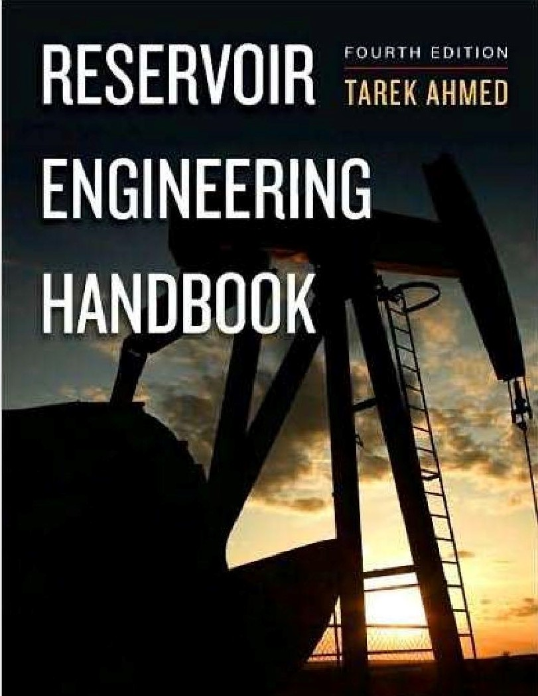

# Oil and Gas Examples Worked in Python 

Python worked examples from Reservoir Engineering Handbook by Tarek Ahmed,PhD

### Prerequisites

###### [Reservoir Engineering Handbook](https://www.amazon.com/Reservoir-Engineering-Handbook-Tarek-Ahmed/dp/0128136499/ref=pd_vtp_14_2/132-7503470-2764465?_encoding=UTF8&pd_rd_i=0128136499&pd_rd_r=22e13e5b-d434-4cd2-a09b-8603359723bb&pd_rd_w=jSomx&pd_rd_wg=0Z06W&pf_rd_p=78799b78-dae3-4301-84de-c8d65b9b651a&pf_rd_r=H9MXB2KS6RVQFVJMEZEH&psc=1&refRID=H9MXB2KS6RVQFVJMEZEH) Fourth Edition by Tarek Ahmed 

You can buy the book on [Amazon Online](https://www.amazon.in/Reservoir-Engineering-Handbook-Tarek-Ahmed-ebook/dp/B004Q9TXC2/ref=sr_1_2?dchild=1&keywords=tarek+ahmed&qid=1594554778&sr=8-2)

## In this repository, each chapter contains 2 folders

* Data - CSV files of data compiled 
* Examples - Jupyter Notebooks of worked examples

## License

This project is licensed under the MIT License - see the [LICENSE.md](LICENSE.md) file for details

## Acknowledgments

* I would like to thank yohanesnuwara, his [reservoir engineering](https://github.com/yohanesnuwara/reservoir-engineering) repository inspired me to make this. 
